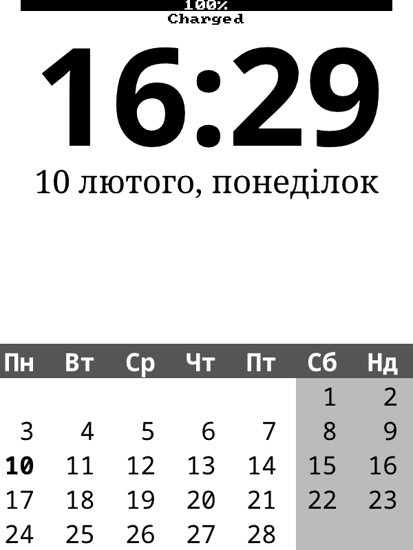

# Kindle 3G Clock and Calendar KUAL Extension

This is a Clock and Calendar KUAL (Kindle Unified Application Launcher) Extension for Kindle 3G. This extension provides an easy-to-use interface to display the current time and calendar on your Kindle device. It integrates seamlessly into the Kindle's system, offering quick access to time and date information directly from the KUAL menu. Currently only Ukrainian locale is supported. Since I have only Kindle 3G, this is my primary target.

## Requirements

- A Jailbroken Kindle (for installing KUAL extensions).
- KUAL (Kindle Unified Application Launcher) must be installed on your Kindle.

## Installation

Download the repo as a zip archive
Extract the `extensions` folder and copy its contents (usually kindle-clock folder) to the `extensions` directory in the root directory of your Kindle.

## Running the Clock extension

Open the KUAL menu and select *Start Kindle Clock*.
You should now see the Clock and Calendar displayed on your Kindle!
After starting it enables Screen Saver and syncronizes time with the specified NTP server.
Note that if a message is printed across the clock, this indicatest that the displayed time may be off. Wait for the clock to refresh to get the accurate reading.

## Contributing

Feel free to fork this repository, submit issues, or make pull requests. Contributions to improve the functionality of the Clock extension are welcome!

## Acknowledgements

Special thanks to the Kindle hacking community and all those who helped make KUAL extensions possible.
